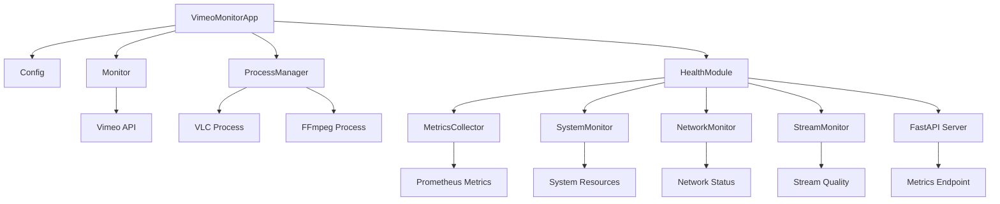

# Architecture

Overview of the Vimeo Monitor system architecture and design decisions.

## 🏗️ System Overview

The Vimeo Monitor is a modular, production-ready system designed for monitoring Vimeo live streams and displaying them full-screen on Raspberry Pi or Linux systems.

### Core Principles
- **Modularity**: Separated concerns with dedicated modules
- **Reliability**: Comprehensive error handling and auto-recovery
- **Security**: Environment-based configuration and credential management
- **Monitoring**: Optional health monitoring with Prometheus metrics
- **Maintainability**: Clean code with type annotations and comprehensive testing

## 📊 Architecture Diagram

## 🔧 Core Components

### VimeoMonitorApp
Main application class that coordinates all system components.

**Responsibilities:**
- Initialize and coordinate all modules
- Handle application lifecycle
- Manage graceful shutdown
- Coordinate health monitoring

**Key Methods:**
- `__init__()`: Initialize application
- `start()`: Start monitoring
- `stop()`: Stop monitoring
- `run()`: Main application loop

### Config
Configuration management and environment variable handling.

**Responsibilities:**
- Load environment variables
- Validate configuration
- Provide configuration access
- Handle configuration errors

**Key Properties:**
- Vimeo API credentials
- Stream configuration
- Logging settings
- Health monitoring settings

### Monitor
Core monitoring functionality for Vimeo streams.

**Responsibilities:**
- Monitor Vimeo API for stream status
- Handle API requests and responses
- Manage stream status changes
- Provide stream information

**Key Methods:**
- `check_stream_status()`: Check if stream is live
- `get_stream_url()`: Get stream URL
- `start_monitoring()`: Start continuous monitoring

### ProcessManager
Process management and subprocess handling.

**Responsibilities:**
- Manage VLC and FFmpeg processes
- Handle process lifecycle
- Monitor process health
- Provide process status

**Key Methods:**
- `start_video_process()`: Start video playback
- `start_holding_process()`: Start holding image
- `stop_current_process()`: Stop current process

## 📊 Health Monitoring Architecture

### HealthModule
Optional health monitoring coordinator.

**Responsibilities:**
- Coordinate health monitoring components
- Manage FastAPI server
- Aggregate health metrics
- Provide health status

### MetricsCollector
Prometheus metrics collection and formatting.

**Responsibilities:**
- Collect metrics from all sources
- Format metrics for Prometheus
- Provide metrics access
- Manage metrics lifecycle

### System Monitor
Hardware and system resource monitoring.

**Responsibilities:**
- Monitor CPU usage
- Monitor memory usage
- Monitor system temperature
- Monitor disk usage

### Network Monitor
Network connectivity and performance monitoring.

**Responsibilities:**
- Check network connectivity
- Measure network latency
- Run speed tests
- Monitor network performance

### Stream Monitor
Stream quality and availability monitoring.

**Responsibilities:**
- Analyze stream quality
- Monitor stream availability
- Collect stream metrics
- Provide stream information

## 🔄 Data Flow

### Stream Monitoring Flow
1. **Monitor** checks Vimeo API for stream status
2. **Config** provides API credentials and configuration
3. **ProcessManager** starts appropriate process based on status
4. **HealthModule** collects metrics about the process
5. **MetricsCollector** formats metrics for Prometheus

### Error Handling Flow
1. **Error Detection**: System detects error condition
2. **Error Logging**: Error is logged with details
3. **Error Recovery**: System attempts recovery
4. **Process Restart**: If needed, process is restarted
5. **Health Monitoring**: Health status is updated

### Health Monitoring Flow
1. **Data Collection**: Health monitors collect system data
2. **Metrics Aggregation**: MetricsCollector aggregates data
3. **Prometheus Formatting**: Metrics are formatted for Prometheus
4. **FastAPI Server**: Metrics are served via HTTP endpoint
5. **External Monitoring**: External systems can scrape metrics

## 🛡️ Security Architecture

### Credential Management
- **Environment Variables**: All credentials stored in environment variables
- **File Permissions**: Secure file permissions on configuration files
- **No Hardcoding**: No credentials hardcoded in source code
- **Validation**: Configuration validation on startup

### Access Control
- **Process Isolation**: Processes run with appropriate permissions
- **Network Security**: Health monitoring server with configurable access
- **Log Security**: Sensitive information excluded from logs
- **File Security**: Secure file handling and permissions

## 🔧 Configuration Architecture

### Environment-Based Configuration
- **Centralized**: All configuration in environment variables
- **Validation**: Configuration validation on startup
- **Flexibility**: Easy configuration changes without code changes
- **Security**: No sensitive data in source code

### Configuration Hierarchy
1. **Environment Variables**: Primary configuration source
2. **Default Values**: Fallback values for optional settings
3. **Validation**: Configuration validation and error handling
4. **Documentation**: Comprehensive configuration documentation

## 📈 Performance Architecture

### Resource Management
- **Memory Management**: Efficient memory usage and cleanup
- **CPU Optimization**: Optimized for Raspberry Pi constraints
- **Network Efficiency**: Minimal API calls and efficient networking
- **Process Management**: Efficient process lifecycle management

### Monitoring and Metrics
- **Performance Metrics**: CPU, memory, and network monitoring
- **Stream Metrics**: Stream quality and availability monitoring
- **System Metrics**: Overall system health monitoring
- **Alerting**: Configurable alerting on performance issues

## 🔄 Error Handling Architecture

### Error Types
- **API Errors**: Vimeo API request failures
- **Process Errors**: VLC/FFmpeg process failures
- **Network Errors**: Network connectivity issues
- **System Errors**: System resource issues

### Error Recovery
- **Retry Logic**: Exponential backoff for transient errors
- **Process Restart**: Automatic process restart on failures
- **Fallback Mechanisms**: Alternative error handling strategies
- **Health Monitoring**: Continuous health monitoring and recovery

## 🧪 Testing Architecture

### Test Structure
- **Unit Tests**: Individual component testing
- **Integration Tests**: Component interaction testing
- **End-to-End Tests**: Complete system testing
- **Performance Tests**: Performance and load testing

### Test Coverage
- **Code Coverage**: Minimum 80% code coverage
- **Critical Paths**: 90% coverage for core functionality
- **New Code**: 100% coverage for new features
- **Documentation**: Documentation testing and validation

## 📚 Related Documentation

- **[API Reference](api-reference.md)** - Complete API documentation
- **[Configuration](configuration.md)** - Configuration reference
- **[Health Monitoring](health-monitoring.md)** - Health monitoring guide
- **[Contributing](contributing.md)** - Development and contribution guide
