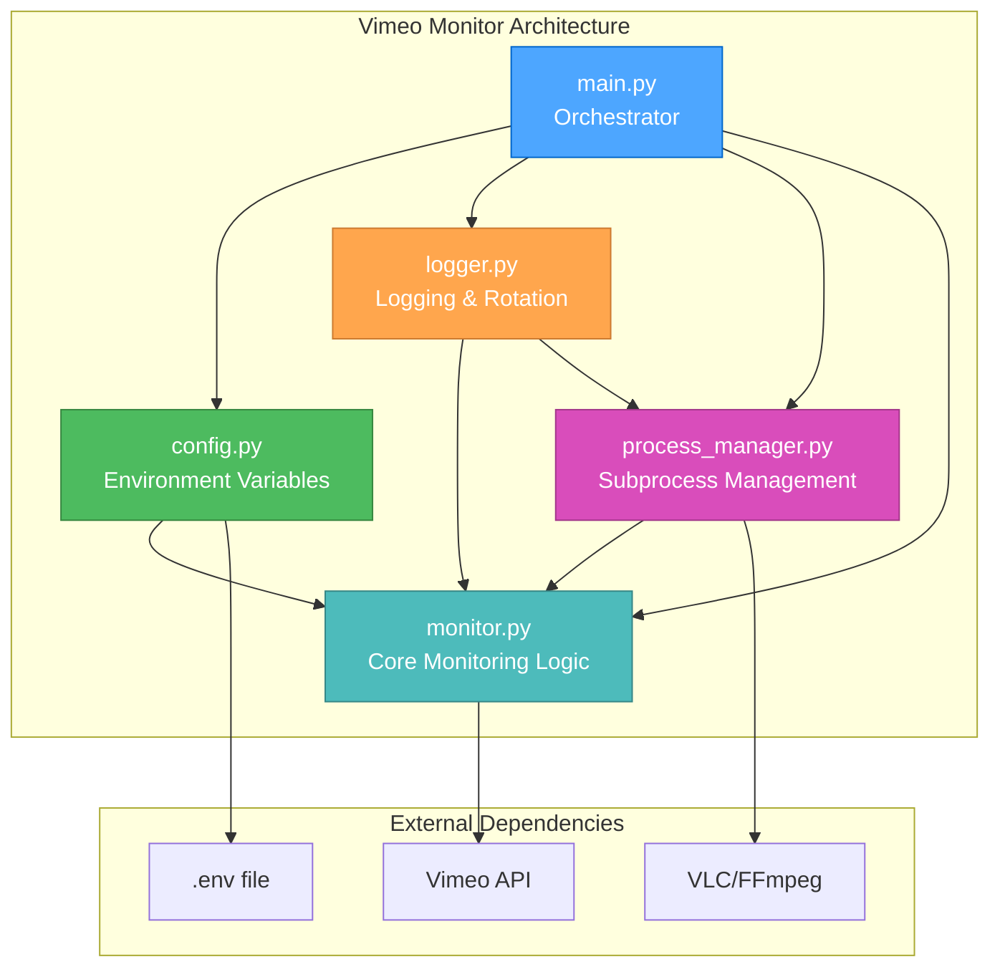

# Vimeo Monitor Architecture Design

## 🎨 CREATIVE PHASE: ARCHITECTURE DESIGN

**Date**: December 2024  
**Status**: Complete  
**Decision**: Hybrid Approach - Incremental Refactoring

## PROBLEM STATEMENT

The current Vimeo Monitor system is a monolithic script with hardcoded credentials, paths, and limited error handling. We need to refactor it into a maintainable, secure, and reliable system while preserving all existing functionality and working in small, testable steps.

## CURRENT SYSTEM ANALYSIS

### Existing Components
- **Main Script** (`streammonitor.py`): 120-line monolithic script
- **Vimeo API Client**: Hardcoded credentials and API interaction
- **Process Management**: Basic subprocess handling for VLC/FFmpeg
- **Logging**: Basic file logging to hardcoded path (`/home/admin/code/stream_monitor.log`)
- **Configuration**: All settings hardcoded in script

### Current Issues
- **Security**: API credentials hardcoded in source code
- **Configuration**: Hardcoded paths and settings
- **Error Handling**: Limited error recovery
- **Code Quality**: Single monolithic script
- **Reliability**: Requires daily restarts (unstable)

## ARCHITECTURE OPTIONS ANALYSIS

### Option 1: Minimal Refactoring (Incremental)
**Description**: Keep current structure, add modules incrementally
**Pros**:
- Lowest risk of breaking existing functionality
- Easy to test each change
- Can deploy changes one at a time
- Minimal learning curve
**Cons**:
- May not achieve full separation of concerns
- Could lead to temporary code duplication
- Slower overall progress
**Complexity**: Low
**Implementation Time**: 2-3 weeks

### Option 2: Clean Architecture (Modular)
**Description**: Complete restructure into clean modules with clear interfaces
**Pros**:
- Clean separation of concerns
- Easy to test individual components
- Better maintainability long-term
- Clear module boundaries
**Cons**:
- Higher risk of breaking changes
- More complex initial implementation
- Requires more comprehensive testing
**Complexity**: Medium
**Implementation Time**: 3-4 weeks

### Option 3: Hybrid Approach (SELECTED)
**Description**: Start with minimal changes, gradually introduce clean architecture
**Pros**:
- Balances risk and maintainability
- Allows incremental testing
- Achieves clean architecture over time
- Can deploy working versions at each step
**Cons**:
- Requires careful planning of transition steps
- Some temporary complexity during transition
**Complexity**: Medium
**Implementation Time**: 3-4 weeks

## SELECTED ARCHITECTURE

### Target System Components



### Module Responsibilities

#### 1. `main.py` - Orchestrator
- **Purpose**: Simple entry point that coordinates all modules
- **Responsibilities**:
  - Initialize configuration
  - Set up logging
  - Start monitoring loop
  - Handle graceful shutdown
  - Coordinate error recovery

#### 2. `config.py` - Configuration Management
- **Purpose**: Centralized configuration loading and validation
- **Responsibilities**:
  - Load environment variables from `.env` file
  - Validate required configuration
  - Provide configuration to other modules
  - Handle missing configuration gracefully

#### 3. `logger.py` - Logging System
- **Purpose**: Structured logging with rotation
- **Responsibilities**:
  - Set up logging configuration
  - Implement log rotation (daily, keep 7 days)
  - Provide consistent logging interface
  - Handle log file management

#### 4. `process_manager.py` - Process Management
- **Purpose**: Enhanced subprocess lifecycle management
- **Responsibilities**:
  - Manage VLC/FFmpeg subprocesses
  - Monitor process health
  - Handle process restarts
  - Clean up processes on shutdown

#### 5. `monitor.py` - Core Monitoring Logic
- **Purpose**: Vimeo API monitoring and stream management
- **Responsibilities**:
  - Poll Vimeo API for stream status
  - Determine stream vs. image mode
  - Coordinate with process manager
  - Handle API errors and retries

## IMPLEMENTATION PHASES

### Phase 1: Foundation (Week 1)
**Goal**: Secure credentials and improve logging

1. **Environment Configuration**
   - Create `.env` file with Vimeo credentials
   - Add `python-dotenv` dependency
   - Create `config.py` module for environment variable loading
   - Update main script to use environment variables

2. **Basic Logging Improvements**
   - Create `logger.py` module
   - Implement simple log rotation (daily, keep 7 days)
   - Replace hardcoded log path with configurable path

**Deliverables**:
- `.env` file with credentials
- `config.py` module
- `logger.py` module
- Updated main script using new modules

### Phase 2: Modularization (Week 2)
**Goal**: Extract process management and improve configuration

1. **Process Management**
   - Create `process_manager.py` module
   - Extract subprocess handling logic
   - Add basic process health monitoring

2. **Configuration Management**
   - Move all hardcoded paths to environment variables
   - Create configuration validation
   - Add error handling for missing configuration

**Deliverables**:
- `process_manager.py` module
- Enhanced `config.py` with validation
- Updated main script with process management

### Phase 3: Enhancement (Week 3)
**Goal**: Extract monitoring logic and improve error handling

1. **Monitor Module**
   - Create `monitor.py` module
   - Extract core monitoring logic
   - Improve error handling and recovery

2. **Main Script Refactor**
   - Simplify main script to orchestrate modules
   - Add graceful shutdown handling
   - Implement basic health checks

**Deliverables**:
- `monitor.py` module
- Refactored `main.py` as orchestrator
- Enhanced error handling throughout

### Phase 4: Production Hardening (Week 4)
**Goal**: Add reliability features and documentation

1. **Error Recovery**
   - Implement auto-restart on process failure
   - Add comprehensive error logging
   - Create basic monitoring endpoints

2. **Documentation & Testing**
   - Update installation documentation
   - Create basic test suite
   - Add troubleshooting guide

**Deliverables**:
- Auto-recovery mechanisms
- Comprehensive documentation
- Basic test suite
- Installation scripts

## CONFIGURATION REQUIREMENTS

### Environment Variables (.env file)
```bash
# Vimeo API Credentials
VIMEO_TOKEN=your_vimeo_token
VIMEO_KEY=your_vimeo_key
VIMEO_SECRET=your_vimeo_secret

# Stream Configuration
STREAM_SELECTION=1
STATIC_IMAGE_PATH=/home/admin/content/OffAirCard.png

# Logging Configuration
LOG_FILE=/home/admin/code/stream_monitor.log
LOG_LEVEL=INFO
LOG_ROTATION_DAYS=7

# Process Configuration
CHECK_INTERVAL=10
MAX_RETRIES=3
```

### Stream IDs (to remain in config.py)
```python
STREAMS = {
    1: "4797083",
    2: "4797121", 
    3: "4898539",
    4: "4797153",
    5: "4797202",
    6: "4797207"
}
```

## VALIDATION CHECKLIST

### Requirements Met
- [✓] Security: Credentials moved to environment variables
- [✓] Configuration: All settings externalized
- [✓] Modularity: Clean separation of concerns
- [✓] Error Handling: Basic improvements with room for enhancement
- [✓] Logging: Simple rotation implemented
- [✓] Maintainability: Clear module boundaries
- [✓] Testing: Incremental approach allows testing at each step

### Technical Feasibility
- **High**: Uses standard Python libraries and proven patterns
- **Dependencies**: Minimal new dependencies (python-dotenv)
- **Platform**: Compatible with existing Raspberry Pi setup

### Risk Assessment
- **Low**: Incremental approach minimizes breaking changes
- **Testing**: Each phase can be tested independently
- **Rollback**: Easy to revert changes if issues arise

## FUTURE ENHANCEMENTS

### Phase 5+ (Future Features)
- Advanced error recovery strategies
- Comprehensive monitoring and alerting
- Performance optimization
- Advanced logging and metrics
- Health check endpoints
- Configuration hot-reloading

## DECISION RATIONALE

**Why Hybrid Approach?**
1. **Risk Management**: Incremental changes reduce risk of breaking production system
2. **Testing**: Each phase can be thoroughly tested before proceeding
3. **Deployment**: Working versions can be deployed at each phase
4. **Learning**: Team can learn new patterns gradually
5. **Maintenance**: Achieves clean architecture without big-bang changes

**Why These Modules?**
1. **Single Responsibility**: Each module has a clear, focused purpose
2. **Loose Coupling**: Modules interact through well-defined interfaces
3. **High Cohesion**: Related functionality is grouped together
4. **Testability**: Each module can be tested independently
5. **Maintainability**: Changes to one module don't affect others

## NEXT STEPS

1. **Update tasks.md** with detailed implementation tasks
2. **Begin Phase 1** implementation
3. **Create test plan** for each phase
4. **Set up development environment** for testing
5. **Document progress** in each phase

---

**Status**: Architecture design complete  
**Next Mode**: IMPLEMENT MODE  
**Priority**: High - Begin Phase 1 implementation
