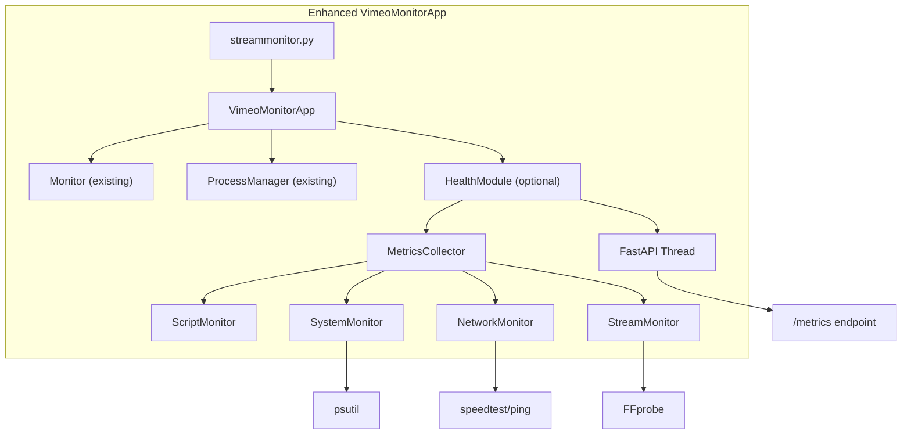

# Health Monitoring System Architecture Decision

**Date:** September 15, 2025  
**Status:** APPROVED  
**Mode:** CREATIVE PHASE COMPLETED  

## 🎨 CREATIVE PHASE SUMMARY

### Problem Statement
Design a Prometheus-compatible health monitoring system that provides comprehensive monitoring of:
- Script health (Vimeo Monitor application)
- Raspberry Pi hardware health (CPU, memory, temperature, disk)
- Network connection health (connectivity, latency, speed)
- Stream health (FFprobe analysis of media streams)

**Key Constraints:**
- Must integrate with existing VimeoMonitorApp architecture
- Easily severable if needed
- Default disabled (opt-in)
- FastAPI preferred
- Synchronized with existing CHECK_INTERVAL (10 seconds)
- Optimized for Raspberry Pi resource constraints

## 🏗️ ARCHITECTURE OPTIONS EVALUATED

### Option 1: Integrated Health Manager (Threading)
- **Pros:** Single process, shared memory, unified config
- **Cons:** Threading complexity, harder failure isolation
- **Verdict:** Good but complex

### Option 2: Microservice Architecture
- **Pros:** Complete isolation, independent scaling
- **Cons:** IPC complexity, separate process management
- **Verdict:** Over-engineered for this use case

### Option 3: Plugin-Based System
- **Pros:** Modular design, easy to extend
- **Cons:** Over-engineering risk, plugin complexity
- **Verdict:** Too complex for requirements

### Option 4: Hybrid Health Module Integration ✅ **SELECTED**
- **Pros:** Minimal disruption, easy to sever, reuses existing patterns
- **Cons:** Some threading complexity
- **Verdict:** **OPTIMAL SOLUTION**

## 🎯 SELECTED ARCHITECTURE: HYBRID HEALTH MODULE

### Core Design Pattern


### Key Design Decisions

1. **Integration Strategy:** Optional module pattern
   - `if config.health_monitoring_enabled: self.health_module = HealthModule(...)`
   - Zero impact when disabled

2. **Web Framework:** FastAPI with uvicorn
   - Lightweight, modern, excellent performance
   - Runs in separate thread with graceful shutdown

3. **Metrics Collection:** Centralized collector pattern
   - Single `MetricsCollector` aggregates all metrics
   - Prometheus format with proper labeling

4. **Monitoring Intervals:** Tiered approach
   - Script monitoring: 10s (matches CHECK_INTERVAL)
   - Hardware monitoring: 10s (lightweight)
   - Network monitoring: 30s (moderate overhead)
   - Stream monitoring: 60s (FFprobe latency)
   - Speed tests: 300s (resource intensive)

## 📊 TECHNICAL SPECIFICATIONS

### File Structure
```
src/vimeo_monitor/
├── health_module.py              # Main coordinator class
├── health/
│   ├── __init__.py
│   ├── metrics_collector.py      # Prometheus aggregator
│   ├── script_monitor.py         # Script health integration
│   ├── system_monitor.py         # Hardware metrics (psutil)
│   ├── network_monitor.py        # Network connectivity & speed
│   └── stream_monitor.py         # FFprobe stream analysis
```

### Configuration Schema (12 New Variables)
```env
# Core Health Monitoring
HEALTH_MONITORING_ENABLED=false      # Default: disabled
HEALTH_METRICS_PORT=8080             # Metrics endpoint port
HEALTH_METRICS_HOST=0.0.0.0          # Bind address

# Monitoring Intervals
HEALTH_HARDWARE_INTERVAL=10          # Hardware metrics frequency
HEALTH_NETWORK_INTERVAL=30           # Network check frequency  
HEALTH_STREAM_INTERVAL=60            # Stream analysis frequency

# Network Monitoring Configuration
HEALTH_NETWORK_ENABLED=true          # Enable network monitoring
HEALTH_NETWORK_PING_HOSTS=8.8.8.8,1.1.1.1,vimeo.com  # Ping targets
HEALTH_NETWORK_SPEEDTEST_ENABLED=true    # Enable speed tests
HEALTH_NETWORK_SPEEDTEST_INTERVAL=300    # Speed test frequency

# Stream and Hardware Configuration
HEALTH_STREAM_ENABLED=true           # Enable stream monitoring
HEALTH_STREAM_FFPROBE_TIMEOUT=15     # FFprobe timeout
HEALTH_HARDWARE_ENABLED=true         # Enable hardware monitoring
```

### Prometheus Metrics (16 Core Metrics)

**Script Health Metrics:**
```
vimeo_monitor_script_health{status="healthy|degraded|error"} 1
vimeo_monitor_api_requests_total 150
vimeo_monitor_api_errors_total 3
vimeo_monitor_stream_uptime_seconds 3600
```

**Hardware Health Metrics:**
```
vimeo_monitor_cpu_usage_percent 45.2
vimeo_monitor_memory_usage_percent 67.8
vimeo_monitor_temperature_celsius 52.1
vimeo_monitor_disk_usage_percent{device="/dev/root"} 78.3
```

**Network Health Metrics:**
```
vimeo_monitor_network_connectivity{host="8.8.8.8"} 1
vimeo_monitor_network_latency_ms{host="8.8.8.8"} 12.5
vimeo_monitor_network_speed_mbps{direction="download"} 95.3
vimeo_monitor_network_speed_mbps{direction="upload"} 18.7
```

**Stream Health Metrics:**
```
vimeo_monitor_stream_availability 1
vimeo_monitor_stream_bitrate_kbps 2500
vimeo_monitor_stream_resolution{dimension="width"} 1920
vimeo_monitor_stream_resolution{dimension="height"} 1080
vimeo_monitor_stream_framerate_fps 30.0
```

### Dependencies & Installation

**New Dependencies (Optional Extras):**
```toml
[project.optional-dependencies]
health = [
    "fastapi>=0.104.0",
    "uvicorn[standard]>=0.24.0",
    "psutil>=5.9.0", 
    "prometheus-client>=0.19.0",
    "speedtest-cli>=2.1.3"
]
```

**System Dependencies:**
- FFmpeg (for FFprobe stream analysis)
- Standard Linux utilities (ping, etc.)

**Installation Script Integration:**
```bash
# Check for FFmpeg
if ! command -v ffprobe &> /dev/null; then
    echo "Installing FFmpeg for stream monitoring..."
    sudo apt-get install -y ffmpeg
fi

# Optional health monitoring
read -p "Enable health monitoring? (y/N): " -n 1 -r
if [[ $REPLY =~ ^[Yy]$ ]]; then
    echo "Installing health monitoring dependencies..."
    uv sync --extra health
    echo "HEALTH_MONITORING_ENABLED=true" >> .env
    echo "Health monitoring enabled!"
fi
```

## 🔧 IMPLEMENTATION STRATEGY

### Integration Points

1. **VimeoMonitorApp Integration:**
```python
class VimeoMonitorApp:
    def __init__(self):
        # ... existing initialization ...
        
        # Optional health monitoring
        if config.health_monitoring_enabled:
            self.health_module = HealthModule(
                config=config,
                logger=self.logger,
                monitor=self.monitor,
                process_manager=self.process_manager
            )
            self.app_logger.info("Health monitoring enabled")
        else:
            self.health_module = None
            self.app_logger.debug("Health monitoring disabled")

    def run(self):
        try:
            # Start health monitoring if enabled
            if self.health_module:
                self.health_module.start()
            
            # ... existing run logic ...
            
        except KeyboardInterrupt:
            self.app_logger.info("Shutdown signal received")
        finally:
            self.shutdown()

    def shutdown(self):
        # ... existing shutdown logic ...
        
        # Shutdown health monitoring
        if self.health_module:
            self.health_module.shutdown()
            self.app_logger.info("Health monitoring stopped")
```

2. **Configuration Extension:**
```python
class Config:
    def __init__(self):
        # ... existing configuration ...
        
        # Health Monitoring Configuration
        self.health_monitoring_enabled: bool = os.getenv("HEALTH_MONITORING_ENABLED", "false").lower() == "true"
        
        if self.health_monitoring_enabled:
            self.health_metrics_port: int = int(os.getenv("HEALTH_METRICS_PORT", "8080"))
            self.health_metrics_host: str = os.getenv("HEALTH_METRICS_HOST", "0.0.0.0")
            # ... additional health config ...

    def validate(self):
        # ... existing validation ...
        
        # Health monitoring validation
        if self.health_monitoring_enabled:
            if not (1024 <= self.health_metrics_port <= 65535):
                raise ValueError("Health metrics port must be between 1024 and 65535")
            # ... additional validation ...
```

### Resource Management Strategy

1. **Thread Management:**
   - FastAPI server: Single dedicated thread
   - Metric collection: Non-blocking, scheduled tasks
   - Graceful shutdown: Coordinated thread termination

2. **Memory Optimization:**
   - Metric storage: Ring buffers for time-series data
   - FFprobe: Process isolation with timeouts
   - Network tests: Rate limiting and caching

3. **CPU Optimization:**
   - Staggered collection intervals (10s/30s/60s/300s)
   - Async I/O for network operations
   - Lazy loading of monitoring components

## ✅ VERIFICATION CHECKLIST

**Architecture Requirements:**
- [x] Minimal disruption to existing code
- [x] Easily severable (single module disable)
- [x] FastAPI integration
- [x] Default disabled with easy configuration
- [x] Raspberry Pi resource optimization
- [x] Synchronized with CHECK_INTERVAL

**Monitoring Capabilities:**
- [x] Script health monitoring (existing Monitor integration)
- [x] Hardware health monitoring (psutil integration)
- [x] Network health monitoring (ping, speedtest)
- [x] Stream health monitoring (FFprobe integration)
- [x] Prometheus-compatible metrics format
- [x] Configurable monitoring intervals

**Implementation Readiness:**
- [x] Clear file structure defined
- [x] Configuration schema documented
- [x] Dependencies identified
- [x] Integration points specified
- [x] Resource management strategy defined

## 🔄 NEXT STEPS

**Ready for IMPLEMENT Mode:**
1. Foundation Setup (HealthModule, MetricsCollector)
2. Individual Monitor Implementation
3. Integration Testing
4. Documentation and Configuration

**Status:** Architecture decision complete, ready for implementation phase.
