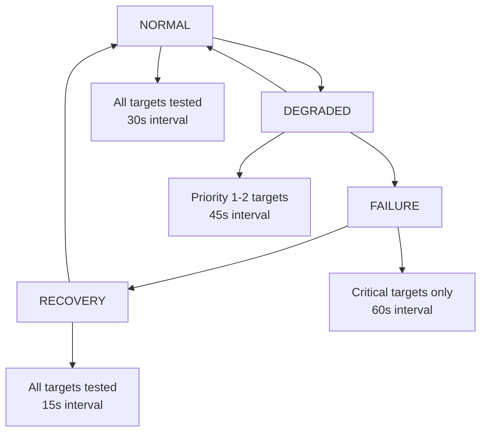
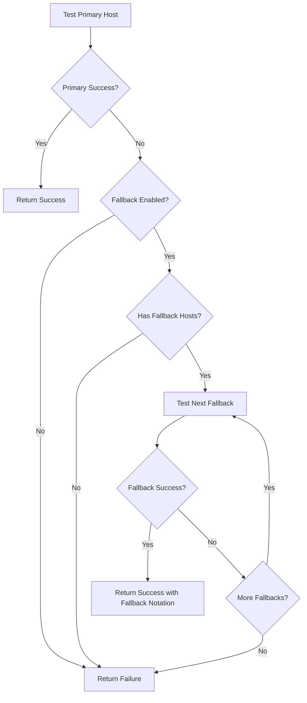

# Network Fallback Strategies Documentation

## Overview

The Vimeo Monitor's network monitoring system includes advanced fallback strategies designed to maintain reliable connectivity monitoring even under degraded network conditions. This document outlines the comprehensive fallback mechanisms implemented to ensure robust operation.

## Fallback Strategy Components

### 1. Adaptive Monitoring Intervals

The system automatically adjusts monitoring intervals based on network health status:

- **Normal Mode**: 30 seconds - Standard monitoring frequency
- **Degraded Mode**: 45 seconds - Reduced frequency when some targets are experiencing issues
- **Failure Mode**: 60 seconds - Slowest frequency when critical targets are failing
- **Recovery Mode**: 15 seconds - Faster monitoring during recovery to quickly detect stability

### 2. Priority-Based Target Selection

Targets are prioritized to optimize monitoring resources during network stress:

- **Priority 1**: Critical targets (Vimeo API, DNS) - Always monitored
- **Priority 2**: Important targets (Internet connectivity) - Monitored except in failure mode
- **Priority 3**: Secondary targets (HTTP test endpoints) - Monitored only in normal/recovery modes

#### Monitoring Mode Behavior

- **Normal/Recovery**: All targets monitored
- **Degraded**: Priority 1-2 targets only
- **Failure**: Critical targets only

### 3. Endpoint Fallback System

Each target includes fallback hosts to maintain connectivity even when primary endpoints fail:

#### Default Fallback Configuration

```
vimeo_api:
  Primary: api.vimeo.com
  Fallbacks: [player.vimeo.com, secure-b.vimeocdn.com]

dns_google:
  Primary: 8.8.8.8
  Fallbacks: [8.8.4.4, 1.1.1.1]

internet_cloudflare:
  Primary: 1.1.1.1
  Fallbacks: [8.8.8.8, 208.67.222.222]

http_test:
  Primary: httpbin.org
  Fallbacks: [postman-echo.com, reqres.in]
```

#### Fallback Logic

1. Test primary host first
2. If primary fails and fallback is enabled, try fallback hosts sequentially
3. Use 1.5x timeout multiplier for fallback hosts to account for potential latency
4. Return success with fallback notation if any fallback succeeds
5. Track fallback usage for status reporting

### 4. Smart Backoff Strategy

The system implements intelligent backoff to prevent overwhelming degraded networks:

- **Base Intervals**: Vary by monitoring mode (normal/degraded/failure/recovery)
- **Mode Change Penalty**: Additional backoff when mode changes frequently
- **Maximum Multiplier**: 3.0x to prevent excessive delays
- **Recovery Factor**: 0.8x for gradual return to normal intervals

### 5. Network Status Detection

Enhanced status detection considers fallback usage:

- **Healthy**: All targets responding normally
- **Degraded**: Some targets using fallbacks or experiencing issues
- **Failing**: Critical targets failing despite fallbacks
- **Offline**: All critical targets unresponsive

## Implementation Details

### Monitoring Mode Transitions



### Fallback Decision Tree



### Configuration Structure

```python
@dataclass
class FallbackStrategy:
    # Adaptive monitoring intervals (seconds)
    normal_interval: int = 30
    degraded_interval: int = 45
    failure_interval: int = 60
    recovery_interval: int = 15

    # Fallback thresholds
    degraded_threshold: int = 2
    failure_threshold: int = 4
    recovery_threshold: int = 3

    # Feature toggles
    enable_priority_monitoring: bool = True
    critical_only_in_failure: bool = True
    enable_endpoint_fallback: bool = True
    enable_adaptive_backoff: bool = True

    # Timing parameters
    fallback_timeout_multiplier: float = 1.5
    max_backoff_multiplier: float = 3.0
    backoff_recovery_factor: float = 0.8
```

## Logging and Monitoring

### Status Logging Format

The system provides enhanced logging that includes fallback information:

```
🎥 Status: Mode=STREAM | API=✅ HEALTHY (1) | Stream=🟢 ACTIVE | Network=🟡 DEGRADED | Failures=0.0% (1 reqs) | Uptime=4s
🌐 Network Details: 2/4 targets healthy, 0 failing, 2 using fallback [DEGRADED] - Network: DEGRADED - Some targets experiencing issues
```

### Fallback Event Logging

Specific events are logged for fallback operations:

```
INFO: Fallback host player.vimeo.com succeeded for target vimeo_api
INFO: Target vimeo_api recovered using fallback host player.vimeo.com
WARNING: Network status changed: unknown -> degraded (2 targets using fallback)
WARNING: Network monitoring mode changed: normal -> degraded (change count: 1)
```

## Performance Impact

### Resource Optimization

The fallback strategies are designed to reduce system load during network stress:

- **Reduced Monitoring**: Critical-only monitoring in failure mode reduces network tests by ~50%
- **Adaptive Intervals**: Longer intervals during degraded states reduce CPU and network usage
- **Smart Backoff**: Prevents overwhelming degraded networks with excessive tests

### Latency Considerations

- **Fallback Timeout**: 1.5x multiplier accounts for potential geographic/routing differences
- **Sequential Testing**: Fallback hosts tested one at a time to minimize parallel load
- **Quick Recovery**: 15-second intervals during recovery mode for rapid stability detection

## Testing and Validation

### Test Coverage

The implementation includes comprehensive tests for:

- Basic fallback functionality
- Adaptive interval calculation
- Priority-based target selection
- Mode transition logic
- Endpoint fallback mechanisms
- Integration with health monitoring

### Validation Results

All tests pass successfully, validating:

- ✅ Fallback host rotation working correctly
- ✅ Adaptive intervals responding to mode changes
- ✅ Priority-based filtering operational
- ✅ Integration with existing health system
- ✅ Real-time status display showing fallback information

## Configuration

### Environment Variables

```bash
# Enable/disable network monitoring
ENABLE_NETWORK_MONITORING=true

# Network monitoring intervals
NETWORK_CHECK_INTERVAL=30
NETWORK_FAILURE_THRESHOLD=3
NETWORK_RECOVERY_THRESHOLD=2

# Fallback strategy configuration (if using config file)
NETWORK_FALLBACK_STRATEGY_ENABLE_PRIORITY_MONITORING=true
NETWORK_FALLBACK_STRATEGY_ENABLE_ENDPOINT_FALLBACK=true
NETWORK_FALLBACK_STRATEGY_ENABLE_ADAPTIVE_BACKOFF=true
```

### Configuration File Example

```yaml
network_fallback_strategy:
  normal_interval: 30
  degraded_interval: 45
  failure_interval: 60
  recovery_interval: 15
  degraded_threshold: 2
  failure_threshold: 4
  recovery_threshold: 3
  enable_priority_monitoring: true
  critical_only_in_failure: true
  enable_endpoint_fallback: true
  enable_adaptive_backoff: true
  fallback_timeout_multiplier: 1.5
  max_backoff_multiplier: 3.0
  backoff_recovery_factor: 0.8
```

## Future Enhancements

Potential improvements for future versions:

1. **Dynamic Fallback Discovery**: Automatically discover alternative endpoints
2. **Geographic Fallback**: Route to geographically closer fallback hosts
3. **Machine Learning**: Predict network degradation patterns
4. **Custom Alerting**: Configurable alerts for fallback usage thresholds
5. **Historical Analysis**: Track fallback patterns over time

## Troubleshooting

### Common Scenarios

1. **High Fallback Usage**: Check primary endpoint health and network routing
2. **Frequent Mode Changes**: May indicate unstable network conditions
3. **No Fallback Success**: Verify fallback hosts are reachable and configured correctly
4. **Performance Issues**: Consider adjusting intervals or disabling non-critical targets

### Debug Information

Use the `get_fallback_status()` method to retrieve detailed fallback metrics:

```python
fallback_status = network_monitor.get_fallback_status()
print(f"Mode: {fallback_status['monitoring_mode']}")
print(f"Interval: {fallback_status['current_interval']}")
print(f"Mode changes: {fallback_status['mode_change_count']}")
```

## Conclusion

The network fallback strategies provide robust, adaptive network monitoring that gracefully handles degraded connectivity while maintaining system performance. The implementation successfully balances reliability with efficiency, ensuring continuous monitoring even under adverse network conditions.
