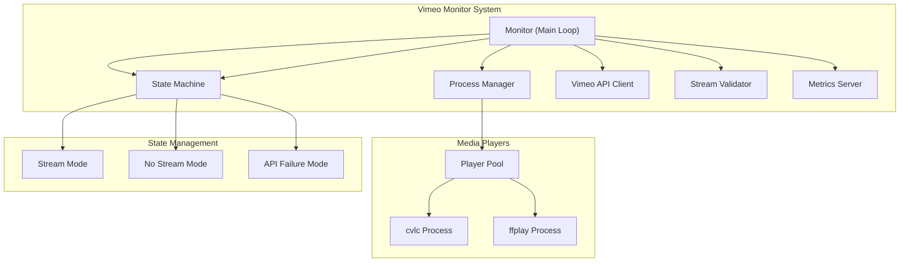
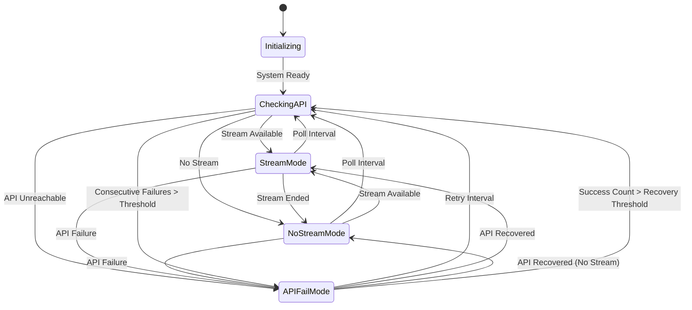

# 🎨🎨🎨 ENTERING CREATIVE PHASE: ARCHITECTURE DESIGN 🎨🎨🎨

## Component: Player Orchestration & State Machine Design

### Component Description
The core orchestration system that manages the Vimeo livestream monitoring service, including player process lifecycle management, state transitions between stream/no-stream/API-failure modes, and self-healing mechanisms for robust operation on Raspberry Pi 5.

### Requirements & Constraints
- **Functional Requirements**:
  - Poll Vimeo API at configurable intervals
  - Validate stream URLs via ffprobe before playback
  - Manage fullscreen video playback with audio
  - Display fallback images when streams unavailable
  - Self-heal from player crashes and API failures
  - Expose Prometheus metrics for monitoring

- **Technical Constraints**:
  - Must run on Raspberry Pi 5 with X11 environment
  - Support multiple media players (cvlc preferred, ffplay fallback)
  - Handle subprocess lifecycle management safely
  - Provide graceful shutdown and error recovery
  - Maintain system stability under API instability

## 🏗️ ARCHITECTURE OPTIONS ANALYSIS

### Option 1: Pure Subprocess Management with State Machine
**Description**: Direct subprocess control using `subprocess.Popen` with a centralized state machine that manages transitions and player lifecycle.

**Pros**:
- Simple and direct control over player processes
- Clear separation between state logic and process management
- Easy to debug and monitor individual components
- Minimal abstraction overhead
- Direct access to process status and control

**Cons**:
- Manual process monitoring and cleanup required
- Potential for zombie processes if not handled carefully
- State machine complexity increases with error handling
- Less robust against edge cases in process management

**Complexity**: Medium
**Implementation Time**: 2-3 days

### Option 2: Supervisor Pattern with Process Pool
**Description**: Implement a supervisor pattern that manages a pool of player processes, with automatic restart capabilities and health monitoring.

**Pros**:
- Robust process management with automatic recovery
- Better handling of edge cases and process failures
- Centralized process lifecycle management
- Easier to implement health checks and monitoring
- More resilient against system-level issues

**Cons**:
- Higher abstraction complexity
- Potential overhead from supervisor processes
- More complex error handling and state management
- Harder to debug individual process issues

**Complexity**: High
**Implementation Time**: 4-5 days

### Option 3: Event-Driven Architecture with Message Queue
**Description**: Event-driven system using message queues for communication between components, with separate processes for API polling, stream validation, and playback.

**Pros**:
- Highly decoupled and modular design
- Easy to extend with new features
- Better separation of concerns
- Scalable architecture for future enhancements
- Robust error isolation between components

**Cons**:
- Significant complexity overhead
- Potential performance impact from message passing
- Over-engineered for current requirements
- Harder to implement and debug
- Not suitable for single-device deployment

**Complexity**: Very High
**Implementation Time**: 1-2 weeks

### Option 4: Hybrid Approach with Process Manager
**Description**: Combine the simplicity of direct subprocess management with a lightweight process manager that handles lifecycle and health monitoring.

**Pros**:
- Balanced complexity and robustness
- Good process management without over-engineering
- Maintains simplicity of direct control
- Better error handling than pure subprocess approach
- Suitable for production deployment

**Cons**:
- Moderate complexity increase
- Requires careful design of process manager interface
- Some abstraction overhead

**Complexity**: Medium-High
**Implementation Time**: 3-4 days

## 🎯 RECOMMENDED APPROACH

**Selected Option**: Option 4 - Hybrid Approach with Process Manager

**Rationale**:
1. **Balanced Complexity**: Provides robustness without over-engineering
2. **Production Ready**: Suitable for Raspberry Pi deployment with proper error handling
3. **Maintainable**: Clear separation of concerns while keeping core logic accessible
4. **Extensible**: Foundation for future enhancements without major refactoring

## 🏗️ IMPLEMENTATION ARCHITECTURE

### Component Structure


### State Machine Design


### Process Manager Interface
```python
class ProcessManager:
    def __init__(self):
        self.current_player = None
        self.player_process = None
        self.health_checker = None
    
    def start_player(self, mode: str, source: str) -> bool:
        """Start appropriate player for given mode and source"""
        
    def stop_current_player(self) -> bool:
        """Safely stop current player process"""
        
    def is_player_healthy(self) -> bool:
        """Check if current player is responding"""
        
    def restart_player(self, mode: str, source: str) -> bool:
        """Restart player with new configuration"""
        
    def cleanup(self):
        """Clean up all processes and resources"""
```

## 🔄 IMPLEMENTATION GUIDELINES

### 1. State Machine Implementation
- Use enum for state definitions
- Implement transition logic with validation
- Add hysteresis for state changes (prevent rapid switching)
- Log all state transitions for debugging

### 2. Process Manager Implementation
- Implement process pool with health monitoring
- Use `subprocess.Popen` with proper signal handling
- Implement timeout mechanisms for process operations
- Add process cleanup on system shutdown

### 3. Error Handling Strategy
- Implement exponential backoff for API failures
- Add circuit breaker pattern for API stability
- Handle process crashes with automatic restart
- Log all errors with context for debugging

### 4. Health Monitoring
- Regular health checks for player processes
- API response time monitoring
- Stream validation success rate tracking
- System resource usage monitoring

## 🎨 CREATIVE CHECKPOINT: Architecture Design Complete

The architecture design addresses all requirements:
- ✅ Player lifecycle management with Process Manager
- ✅ State machine with proper transitions and hysteresis
- ✅ Error handling and self-healing mechanisms
- ✅ Monitoring and metrics integration
- ✅ Production-ready deployment considerations

## 🎨🎨🎨 EXITING CREATIVE PHASE - DECISION MADE 🎨🎨🎨

**Architecture Decision**: Hybrid Approach with Process Manager
- **Process Management**: Lightweight Process Manager with subprocess control
- **State Management**: Centralized state machine with hysteresis
- **Error Handling**: Circuit breaker pattern with exponential backoff
- **Monitoring**: Integrated health checks and metrics

**Next Steps**: Update tasks.md with architecture decisions and proceed to implementation planning.
