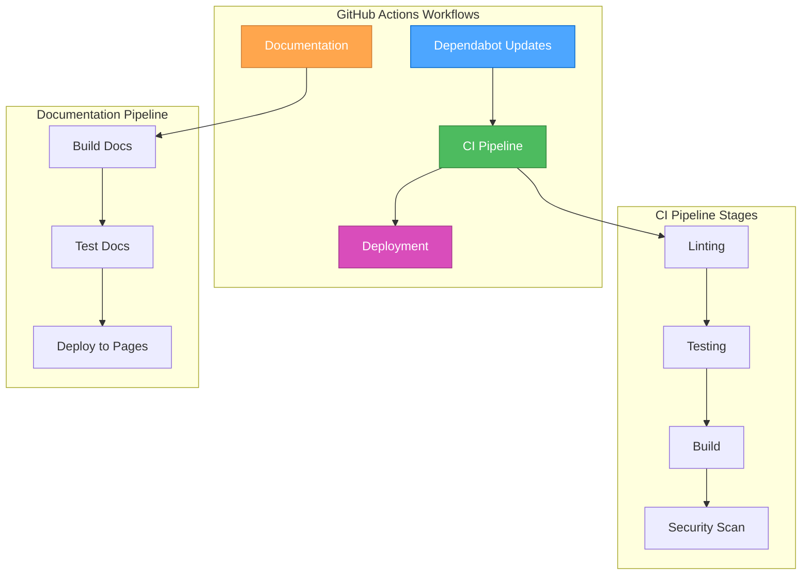

# 🎨🎨🎨 ENTERING CREATIVE PHASE: ENVIRONMENT SETUP DESIGN 🎨🎨🎨

## Component: Development Environment Setup

### Component Description
Design and implement a comprehensive development environment setup including Dependabot configuration for UV dependency management, GitHub Actions for MkDocs documentation publishing, and a basic CI/CD pipeline suitable for early development phases.

### Requirements & Constraints
- **Functional Requirements**:
  - Automate dependency updates using Dependabot with UV support
  - Automate MkDocs documentation publishing to GitHub Pages
  - Implement basic CI/CD pipeline for development workflow
  - Support both development and production deployment scenarios

- **Technical Constraints**:
  - Must work with UV package manager (not pip)
  - Should be lightweight and not overly strict for early development
  - Must integrate with existing pyproject.toml configuration
  - Should support GitHub Pages deployment
  - Must be maintainable and extensible

## 🏗️ ENVIRONMENT SETUP OPTIONS ANALYSIS

### Option 1: Minimal Dependabot + Basic GitHub Actions
**Description**: Simple Dependabot configuration for UV dependencies and basic GitHub Actions for documentation and testing.

**Pros**:
- Simple and easy to maintain
- Quick to implement and debug
- Minimal overhead and complexity
- Easy to extend later
- Suitable for early development

**Cons**:
- Limited automation capabilities
- Manual intervention may be required
- Less robust error handling
- Limited deployment automation

**Complexity**: Low
**Implementation Time**: 1-2 days

### Option 2: Comprehensive Dependabot + Advanced GitHub Actions
**Description**: Full-featured Dependabot setup with comprehensive GitHub Actions including testing, linting, security scanning, and automated deployment.

**Pros**:
- Maximum automation and reliability
- Comprehensive testing and validation
- Security scanning and vulnerability detection
- Professional-grade CI/CD pipeline
- Reduced manual intervention

**Cons**:
- Higher complexity and maintenance overhead
- May be too strict for early development
- Longer implementation time
- More potential points of failure
- Over-engineering for current needs

**Complexity**: High
**Implementation Time**: 3-5 days

### Option 3: Balanced Approach with Progressive Enhancement
**Description**: Start with essential automation (Dependabot + basic CI/CD) and progressively enhance with additional features as development progresses.

**Pros**:
- Balanced complexity and functionality
- Progressive enhancement approach
- Suitable for current development phase
- Easy to extend and improve
- Maintains development velocity

**Cons**:
- Requires ongoing maintenance and updates
- May need refactoring as requirements evolve
- Moderate initial complexity

**Complexity**: Medium
**Implementation Time**: 2-3 days

### Option 4: Template-Based Setup with Customization
**Description**: Use existing GitHub Actions templates and Dependabot configurations as starting points, customizing for specific project needs.

**Pros**:
- Faster implementation using proven patterns
- Community-tested configurations
- Good starting point for customization
- Reduced design time
- Industry best practices

**Cons**:
- May include unnecessary complexity
- Less tailored to specific project needs
- Potential for template bloat
- May need significant customization

**Complexity**: Medium
**Implementation Time**: 2-3 days

## 🎯 RECOMMENDED APPROACH

**Selected Option**: Option 3 - Balanced Approach with Progressive Enhancement

**Rationale**:
1. **Development Phase Appropriate**: Not over-engineering for early development
2. **Extensible**: Can grow with project needs
3. **Maintainable**: Balanced complexity for current team capacity
4. **Professional**: Provides essential automation without overwhelming complexity

## 🏗️ IMPLEMENTATION ARCHITECTURE

### Dependabot Configuration
```yaml
# .github/dependabot.yml
version: 2
updates:
  # Python dependencies managed by UV
  - package-ecosystem: "pip"
    directory: "/"
    schedule:
      interval: "weekly"
      day: "monday"
      time: "09:00"
    open-pull-requests-limit: 10
    reviewers:
      - "dcapparelli"
    assignees:
      - "dcapparelli"
    commit-message:
      prefix: "deps"
      include: "scope"
    labels:
      - "dependencies"
      - "automated"
    # UV-specific configuration
    target-branch: "main"
    allow:
      - dependency-type: "direct"
      - dependency-type: "indirect"
```

### GitHub Actions Workflow Structure


### CI/CD Pipeline Design
```yaml
# .github/workflows/ci.yml
name: CI Pipeline

on:
  push:
    branches: [ main, develop ]
  pull_request:
    branches: [ main, develop ]

jobs:
  lint:
    runs-on: ubuntu-latest
    steps:
      - uses: actions/checkout@v4
      - uses: actions/setup-python@v4
        with:
          python-version: '3.12'
      - name: Install UV
        uses: astral-sh/setup-uv@v1
      - name: Install dependencies
        run: uv sync --dev
      - name: Run linting
        run: uv run ruff check .

  test:
    runs-on: ubuntu-latest
    needs: lint
    steps:
      - uses: actions/checkout@v4
      - uses: actions/setup-python@v4
        with:
          python-version: '3.12'
      - uses: astral-sh/setup-uv@v1
      - run: uv sync --dev
      - run: uv run pytest

  docs:
    runs-on: ubuntu-latest
    needs: test
    steps:
      - uses: actions/checkout@v4
      - uses: actions/setup-python@v4
        with:
          python-version: '3.12'
      - uses: astral-sh/setup-uv@v1
      - run: uv sync --dev
      - run: uv run mkdocs build
      - name: Deploy to GitHub Pages
        uses: peaceiris/actions-gh-pages@v3
        if: github.ref == 'refs/heads/main'
        with:
          github_token: ${{ secrets.GITHUB_TOKEN }}
          publish_dir: ./site
```

### Documentation Publishing Workflow
```yaml
# .github/workflows/docs.yml
name: Documentation

on:
  push:
    branches: [ main ]
  workflow_dispatch:

permissions:
  contents: read
  pages: write
  id-token: write

concurrency:
  group: "pages"
  cancel-in-progress: false

jobs:
  build:
    runs-on: ubuntu-latest
    steps:
      - uses: actions/checkout@v4
      - uses: actions/setup-python@v4
        with:
          python-version: '3.12'
      - uses: astral-sh/setup-uv@v1
      - name: Install dependencies
        run: uv sync --dev
      - name: Build documentation
        run: uv run mkdocs build
      - name: Setup Pages
        uses: actions/configure-pages@v4
      - name: Upload artifact
        uses: actions/upload-pages-artifact@v3
        with:
          path: './site'

  deploy:
    environment:
      name: github-pages
      url: ${{ steps.deployment.outputs.page_url }}
    runs-on: ubuntu-latest
    needs: build
    steps:
      - name: Deploy to GitHub Pages
        id: deployment
        uses: actions/deploy-pages@v4
```

## 🔄 IMPLEMENTATION GUIDELINES

### 1. Dependabot Configuration
- Configure for pip ecosystem (UV compatible)
- Set weekly update schedule
- Include proper labeling and assignment
- Configure commit message format
- Set reasonable PR limits

### 2. GitHub Actions Setup
- Use Ubuntu latest runners
- Implement UV setup using official action
- Separate concerns into focused workflows
- Use proper job dependencies
- Implement proper error handling

### 3. CI/CD Pipeline Design
- Start with essential checks (lint, test)
- Progressive enhancement approach
- Not overly strict for early development
- Easy to bypass when needed
- Clear success/failure indicators

### 4. Documentation Publishing
- Automated build and deployment
- GitHub Pages integration
- Proper branch protection
- Version control for documentation
- Easy rollback capabilities

## 🎨 CREATIVE CHECKPOINT: Environment Setup Design Complete

The environment setup design addresses all requirements:
- ✅ Dependabot configuration for UV dependencies
- ✅ GitHub Actions for documentation publishing
- ✅ Basic CI/CD pipeline for development workflow
- ✅ Progressive enhancement approach
- ✅ Maintainable and extensible design

## 🎨🎨🎨 EXITING CREATIVE PHASE - DECISION MADE 🎨🎨🎨

**Environment Setup Decision**: Balanced Approach with Progressive Enhancement
- **Dependabot**: Weekly updates with proper labeling and assignment
- **GitHub Actions**: Separate workflows for CI, docs, and deployment
- **CI/CD Pipeline**: Essential checks with progressive enhancement
- **Documentation**: Automated build and GitHub Pages deployment

**Next Steps**: Update tasks.md with environment setup decisions and proceed to implementation.
