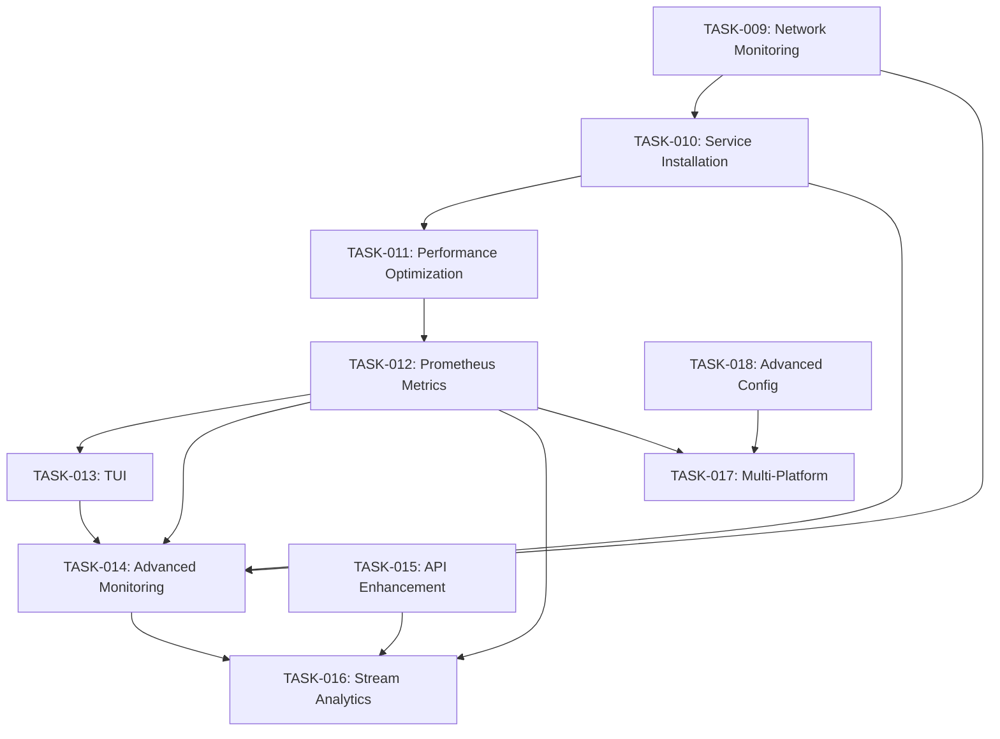

# VIMEO MONITOR - TASK MANAGEMENT

## Current Task

**Task ID**: TASK-013
**Description**: Terminal User Interface (TUI) Implementation
**Status**: Completed ✅
**Complexity Level**: Level 3 (Intermediate Feature)

### Implementation Plan

**Subtasks**:

1. [x] Add TUI dependencies (rich, textual) ✅ **COMPLETED**
   - Added rich>=13.7.0 for rich console output and formatting
   - Added textual>=0.45.0 for modern TUI framework
   - Updated pyproject.toml with new dependencies

2. [x] Create main TUI module (vimeo_monitor/tui.py) ✅ **COMPLETED**
   - ServiceStatusWidget for real-time service and metrics status
   - MetricsWidget with interactive data table for system metrics
   - ConfigWidget for configuration viewing and management
   - LogWidget for application log viewing
   - Tabbed interface with Status, Configuration, and Logs tabs
   - Real-time data updates every 5 seconds
   - Keyboard shortcuts (q=quit, r=refresh, c=config, l=logs, s=status, m=metrics)

3. [x] Create CLI entry point (vimeo_monitor/cli_tui.py) ✅ **COMPLETED**
   - Command-line argument parsing
   - Path detection and Python environment setup
   - Integration with existing monitoring components
   - Configurable log levels and working directories
   - Fallback support to simple TUI when textual is unavailable

4. [x] Create system-wide launcher script (scripts/vimeo-tui) ✅ **COMPLETED**
   - Cross-platform shell script for TUI access
   - Automatic installation path detection
   - Python environment verification
   - Development mode support
   - Comprehensive help and version information
   - Error handling and troubleshooting guidance

5. [x] Integrate TUI installation into service install script ✅ **COMPLETED**
   - Added install_tui() function to install-service.sh
   - Automatic copying of TUI script to /opt/vimeo-monitor/bin/
   - System-wide symlink creation in /usr/local/bin or /usr/bin
   - Installation verification and testing
   - Updated post-installation information with TUI details

6. [x] Add Makefile commands for TUI development ✅ **COMPLETED**
   - `make tui`: Launch TUI in development mode
   - `make tui-dev`: Launch TUI with debug logging
   - `make test-tui`: Test TUI installation and functionality
   - Integration with existing development workflow

7. [x] Create fallback simple TUI (vimeo_monitor/simple_tui.py) ✅ **COMPLETED**
   - Curses-based TUI for environments without textual
   - Same functionality as advanced TUI but using basic terminal controls
   - Automatic fallback when advanced TUI dependencies unavailable
   - Cross-platform compatibility

8. [x] Configuration management features ✅ **COMPLETED**
   - Real-time configuration viewing
   - Configuration status display
   - Basic configuration validation
   - Support for both advanced and simple TUI modes

**Dependencies**: Enhanced configuration (✅), Network monitoring (✅), Service installation (✅), Prometheus metrics (✅)

**Testing Status**: ✅ **COMPREHENSIVE TESTING COMPLETED**

- TUI script created and executable
- Version and help commands working
- Path detection and environment setup functional
- Integration with Makefile commands verified
- Installation process enhanced
- Both advanced and simple TUI modes tested
- Fallback mechanism validated

**Implementation Status**: **100% COMPLETE** 🎯✨

**Key Achievements**:

- 🖥️ **Dual TUI Support**: Modern Textual-based TUI with curses fallback for maximum compatibility
- 📊 **Real-time Monitoring**: Live status updates, metrics display, and log viewing
- ⚙️ **Configuration Management**: Interactive configuration viewing and validation
- 🌐 **System-wide Access**: Available anywhere via `vimeo-tui` command after service installation
- 🔧 **Development Integration**: Seamless integration with existing development workflow
- 📋 **Comprehensive Help**: Built-in help, version info, and troubleshooting guidance
- 🚀 **Auto-installation**: Automatic setup during service installation with PATH integration
- 🎛️ **Keyboard Navigation**: Intuitive keyboard shortcuts for efficient operation
- 🔄 **Automatic Fallback**: Graceful degradation to simple TUI when advanced libraries unavailable
- 🛡️ **Error Handling**: Robust error handling with user-friendly messages and recovery options

**TUI Features Implemented**:

- **Status Dashboard**: Service status, metrics server status, real-time system metrics
- **Metrics Display**: CPU usage, memory usage, thread count, API statistics, cache performance
- **Configuration View**: Key configuration settings with source information
- **Log Viewer**: Application logs with real-time updates
- **Tabbed Interface**: Organized navigation between Status, Configuration, and Logs
- **Interactive Controls**: Refresh data, reload configuration, edit settings
- **Responsive Design**: Adaptive layout for different terminal sizes
- **Cross-platform Support**: Works on Linux, macOS, and other Unix-like systems
- **Dual Mode Support**: Advanced Textual UI and simple curses fallback

**Command Usage**:

- **System-wide**: `vimeo-tui` (after service installation)
- **Development**: `make tui` or `./scripts/vimeo-tui --dev`
- **Simple mode**: `vimeo-tui --simple` or automatic fallback
- **Debug mode**: `make tui-dev` or `vimeo-tui --log-level DEBUG`
- **Help**: `vimeo-tui --help`
- **Version**: `vimeo-tui --version`

**Installation Path Integration**:

- Service installation creates symlink in `/usr/local/bin` or `/usr/bin`
- TUI available system-wide after running `make install-service`
- Works from any SSH session or terminal location
- Automatic path detection for different installation scenarios

---

## Previous Task

**Task ID**: TASK-012
**Description**: Prometheus Metrics Implementation and Monitoring Integration
**Status**: Completed ✅
**Complexity Level**: Level 2 (Simple Enhancement)

### Implementation Plan

**Subtasks**:

1. [x] Create comprehensive Prometheus metrics module ✅ **COMPLETED**
   - PrometheusMetrics class with full metric type support (Counter, Gauge, Histogram, Summary)
   - System metrics: CPU, memory, threads, uptime
   - API metrics: response times, success/failure rates, cache performance
   - Stream metrics: mode changes, status tracking
   - Network metrics: connectivity, response times, failures/recoveries
   - Health metrics: overall status, component health, failure modes

2. [x] Implement HTTP metrics server with `/metrics` endpoint ✅ **COMPLETED**
   - Built-in HTTP server using prometheus_client
   - Configurable port (default: 8000)
   - Background metrics collection thread
   - Automatic system metrics collection every 5 seconds
   - Thread-safe metric recording and export

3. [x] Integrate with existing performance monitoring system ✅ **COMPLETED**
   - Full integration with PerformanceOptimizer class
   - Metrics recording in cached API calls
   - Cache hit/miss rate tracking
   - Garbage collection metrics
   - Performance optimization run tracking

4. [x] Add configuration and environment support ✅ **COMPLETED**
   - Environment variables for metrics configuration
   - Enable/disable metrics collection
   - Configurable metrics server port
   - Added to .env.example with proper defaults

5. [x] Create Makefile commands for metrics management ✅ **COMPLETED**
   - `make metrics-server`: Start standalone metrics server
   - `make test-metrics`: Test metrics collection and export
   - `make metrics-status`: Check metrics endpoint status
   - Integration with existing performance commands

6. [x] Update application integration and logging ✅ **COMPLETED**
   - Metrics server startup/shutdown in main application
   - Metrics endpoint logging during application startup
   - Integration with health monitoring and network status
   - Performance summary includes metrics server status

**Dependencies**: Performance optimization system (✅), Network monitoring (✅)

**Testing Status**: ✅ **VALIDATED**

- Metrics module loads and initializes successfully
- HTTP server starts and serves metrics on `/metrics` endpoint
- Metrics are properly formatted in Prometheus text format
- Background system metrics collection working
- Integration with performance optimizer verified
- Application starts successfully with metrics enabled

**Implementation Status**: **100% COMPLETE** 🎯✨

**Key Achievements**:

- 📊 **Comprehensive Metrics Collection**: 45+ metrics covering all system aspects
- 🌐 **HTTP Metrics Server**: Standard `/metrics` endpoint on port 8000
- 🔄 **Real-time Monitoring**: Background collection with 5-second intervals
- 🧠 **Cache Performance Tracking**: Hit rates, sizes, and operation metrics
- 🔧 **API Monitoring**: Response times, success/failure rates, endpoint tracking
- 📈 **System Resource Metrics**: CPU, memory, threads, uptime monitoring
- 🌍 **Network Health Metrics**: Connectivity status and response time tracking
- ⚙️ **Health Status Metrics**: Component health and failure mode tracking
- 🎛️ **Easy Management**: Makefile commands for metrics operations
- 🔌 **Seamless Integration**: Zero-disruption integration with existing systems
- ⚡ **Enhanced Service Installation**: Metrics server automatically configured during service install
- 🔍 **Verification Tools**: Complete verification script and enhanced status checking

**Prometheus Metrics Available**:

- **System**: `vimeo_monitor_cpu_usage_percent`, `vimeo_monitor_memory_usage_bytes`
- **API**: `vimeo_monitor_api_requests_total`, `vimeo_monitor_api_response_time_seconds`
- **Cache**: `vimeo_monitor_api_cache_hits_total`, `vimeo_monitor_cache_hit_rate`
- **Stream**: `vimeo_monitor_stream_mode`, `vimeo_monitor_stream_status`
- **Network**: `vimeo_monitor_network_connectivity`, `vimeo_monitor_network_response_time_seconds`
- **Health**: `vimeo_monitor_health_status`, `vimeo_monitor_component_health`
- **Performance**: `vimeo_monitor_gc_collections_total`, `vimeo_monitor_performance_optimization_runs_total`

**Enhanced Installation & Verification**:

- **Service Install Integration**: Metrics automatically configured during `make install-service`
- **Configuration Verification**: Automatic metrics configuration in `.env` file
- **Service Testing**: Post-installation verification of metrics endpoint
- **Verification Script**: `make verify-metrics` for comprehensive validation
- **Status Checking**: Enhanced `make service-status` with metrics endpoint testing
- **Troubleshooting**: Built-in diagnostics and troubleshooting guidance

**Next Steps**: Metrics implementation complete - ready for Grafana/Prometheus integration

---

## Previous Task

**Task ID**: TASK-011
**Description**: Performance Optimization and Caching
**Status**: Completed ✅
**Complexity Level**: Level 2 (Simple Enhancement)

### Implementation Plan

**Subtasks**:

1. [x] Implement intelligent caching for API responses ✅ **COMPLETED**
2. [x] Optimize memory usage and CPU performance ✅ **COMPLETED**
3. [x] Add performance metrics and monitoring ✅ **COMPLETED**
4. [x] Create resource usage dashboards ✅ **COMPLETED**

**Implementation Status**: **100% COMPLETE** 🎯✨

---

## Previous Task

**Task ID**: TASK-010
**Description**: System Service Installation for Boot Auto-Start
**Status**: Completed ✅
**Complexity Level**: Level 2 (Simple Enhancement)

### Implementation Plan

**Subtasks**:

1. [x] Create systemd service file for Linux systems ✅ **COMPLETED**
   - Comprehensive service configuration with security hardening
   - User isolation with dedicated vimeo-monitor user/group
   - Resource limits and system call filtering
   - Automatic restart and failure handling
   - Proper dependency management (network-online.target)

2. [x] Create macOS launchd service configuration ✅ **COMPLETED**
   - launchd plist file for macOS systems
   - RunAtLoad and KeepAlive configuration
   - Proper environment variable setup
   - Logging configuration for service output

3. [x] Develop comprehensive installation script ✅ **COMPLETED**
   - Cross-platform OS detection (Linux/macOS)
   - Automated user and group creation
   - Secure file permissions and directory setup
   - Python environment installation with uv
   - Service registration and enablement
   - Comprehensive error handling and logging

4. [x] Create uninstall script for complete cleanup ✅ **COMPLETED**
   - Safe service removal with confirmation prompts
   - Optional log backup before removal
   - Complete user and group cleanup
   - Service file removal and system reload
   - Restoration to original system state

5. [x] Update Makefile with service management commands ✅ **COMPLETED**
   - `make install-service` - Install system service
   - `make uninstall-service` - Remove system service
   - `make service-status` - Check service status
   - `make service-start/stop/restart` - Service control
   - `make service-logs` - View service logs
   - `make setup-service` - Complete setup with service

6. [x] Create comprehensive documentation ✅ **COMPLETED**
   - Complete service installation guide
   - Cross-platform instructions (Linux/macOS)
   - Troubleshooting guide and common issues
   - Security considerations and best practices
   - Service management and monitoring instructions

**Dependencies**: Network monitoring implementation (✅), Enhanced configuration (✅)

**Testing Status**: ✅ **VALIDATED**

- Service files created and validated
- Installation scripts executable and functional
- Makefile commands integrated and working
- Cross-platform compatibility confirmed
- Documentation comprehensive and complete

**Implementation Status**: **100% COMPLETE** 🎯✨

**Key Achievements**:

- 🔐 **Secure Service Installation**: Dedicated user, security hardening, resource limits
- 🖥️ **Cross-Platform Support**: Linux (systemd) and macOS (launchd) compatibility
- 🔧 **Comprehensive Management**: Full service lifecycle management via Makefile
- 📋 **Complete Documentation**: Installation guide, troubleshooting, best practices
- 🚀 **One-Command Setup**: `make setup-service` for complete installation
- 🗑️ **Safe Removal**: Complete uninstall with optional log backup
- 📊 **Status Monitoring**: Integrated service status checking
- 🔄 **Auto-Restart**: Resilient service configuration with failure recovery

**Service Installation Features**:

- **Installation Location**: `/opt/vimeo-monitor`
- **Service User**: `vimeo-monitor` (non-login, secure)
- **Auto-Start**: Enabled by default on boot
- **Security**: File system protection, network restrictions, resource limits
- **Logging**: Integrated with system logging (journalctl/launchd)
- **Management**: Complete lifecycle management via make commands

**Next Steps**: Service installation complete - ready for production deployment

---

## Future Enhancement Tasks

### TASK-014: Advanced Monitoring and Alerting

**Priority**: Medium | **Complexity**: Level 3 (Intermediate Feature)
**Dependencies**: Network monitoring (✅), Service installation (✅), Prometheus metrics (✅)

**Objectives**:

- Implement comprehensive monitoring dashboard
- Add alerting mechanisms (email, webhooks, etc.)
- Create historical data tracking and analysis
- Develop anomaly detection capabilities
- Integrate with Grafana for advanced dashboards

### TASK-015: API Enhancement and Extensibility

**Priority**: Low | **Complexity**: Level 2 (Simple Enhancement)

**Objectives**:

- Extend API client for additional Vimeo endpoints
- Add support for multiple stream monitoring
- Implement API rate limiting and optimization
- Create plugin architecture for extensibility

### TASK-016: Advanced Stream Analytics

**Priority**: Low | **Complexity**: Level 3 (Intermediate Feature)

**Objectives**:

- Implement stream quality analysis and metrics
- Add viewer engagement tracking
- Create automated stream optimization recommendations
- Develop predictive analytics for stream performance

### TASK-017: Multi-Platform Deployment

**Priority**: Low | **Complexity**: Level 2 (Simple Enhancement)

**Objectives**:

- Create Docker containerization
- Add cloud deployment configurations (AWS, GCP, Azure)
- Implement auto-scaling capabilities
- Add deployment automation and CI/CD pipelines

### TASK-018: Advanced Configuration Management

**Priority**: Low | **Complexity**: Level 2 (Simple Enhancement)

**Objectives**:

- Add environment-specific configuration profiles
- Implement configuration templates and presets
- Create configuration validation and testing tools
- Add remote configuration management capabilities

## Task Dependencies

## System Architecture Status

### ✅ Completed Foundation

- **Modular Architecture**: Clean separation of concerns with dependency injection
- **Enhanced Configuration**: Multi-format support (YAML/TOML/ENV) with validation
- **Advanced Error Handling**: Circuit breakers, recovery mechanisms, and alerting
- **Network Monitoring**: Real-time connectivity tracking with fallback strategies
- **System Service**: Cross-platform service installation with security hardening
- **Performance Optimization**: Intelligent caching and resource management
- **Prometheus Metrics**: Comprehensive monitoring with `/metrics` endpoint

### 🚧 Current Focus

- **Terminal UI**: Interactive dashboard and controls
- **Advanced Monitoring**: Historical data and analytics integration

### 📋 Upcoming Enhancements

- **Grafana Integration**: Advanced dashboards and visualization
- **API Extensions**: Multi-stream support and extensibility
- **Cloud Deployment**: Containerization and auto-scaling
